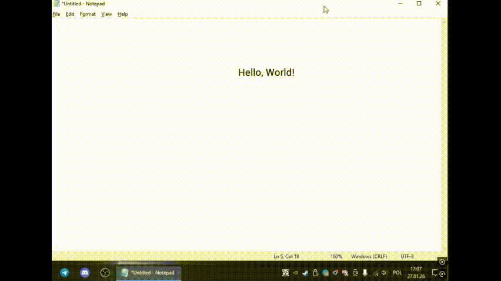
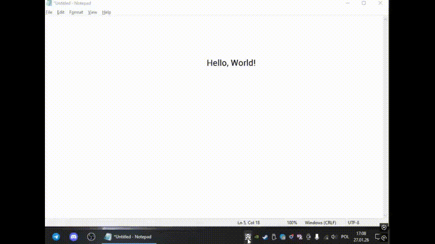

# COT
Crossplatform OCR Translation tool **COT** for translating text on your screen.<br>

Currently supports **[DeepL](https://www.deepl.com/)** and **[LibreTranslate](https://libretranslate.com/)** as translation APIs, and **[Tesseract](https://github.com/tesseract-ocr/tesseract)** as an OCR engine.

## Demonstration
Features 2 modes:
- **Notification**<br>
    Uses native notifications to show the translation.<br>
    Ideal for translating small phrases and separate words.


- **TextBox**<br>
    Prints translated text near your selection.<br>
    Ideal for translating big chunks of text.


## Requirements
- Java 21+
- Network connection

## Installation
1. Download the latest archive from the **Releases** tab and extract the contents.
2. Download **.traineddata** files for Tesseract for the languages you are going to translate:<br>
[Fast versions](https://github.com/tesseract-ocr/tessdata_fast) <br>
[Default versions](https://github.com/tesseract-ocr/tessdata_fast) <br>
And put them in ```ocrdata/tessdata/```
3. Get your DeepL or Libre API key:<br>
[DeepL](https://www.deepl.com/en/pro/change-plan#developer)<br>
[Libre (no free plan)](https://portal.libretranslate.com/)
4. Paste your key in the corresponding file:<br>
```api/Deepl/key.txt```<br>
```api/Libre/key.txt```
5. Run the .jar executable in the root folder.
6. Set your preferred input and output languages, presentation mode and translator(DeepL by default).
7. Use **Ctrl + Shift + C** to select a region you want to translate.

*Note:* If you use TextBox mode or encounter some error, use the shortcut to hide the selection overlay

### Shortcut
You can change the shortcut by editing the ```assets/shortcut.txt``` file.

## Currently known problems
- Tesseract may fail to read selected text.
- Tesseract may recognise abstract shapes as characters.

These can not be fully fixed.

## Acknowledgements
This project uses [JNativeHook](https://github.com/kwhat/jnativehook), [Tess4J](https://github.com/nguyenq/tess4j), [DeepL Java Library](https://github.com/DeepLcom/deepl-java).
